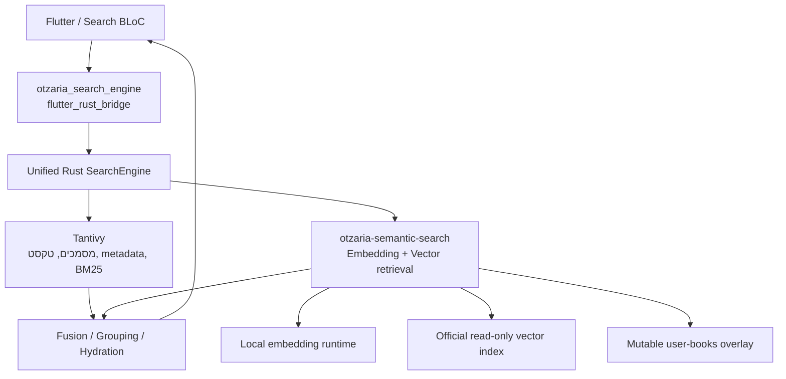

## מסקנה

הפרויקט הוא שלד ארכיטקטוני טוב, אבל עדיין לא מנוע חיפוש סמנטי עובד. שני החלקים הקריטיים—Inference אמיתי ואחסון וקטורים מתמשך—הם כרגע placeholders.

הכיוון הנכון ל־FFI אינו executable נפרד. עדיף להשאיר את `otzaria-semantic-search` כ־Rust crate פנימי, לצרף אותו כתלות של `otzaria_search_engine`, ולארוז את שניהם באותה ספרייה ילידית שכבר נבנית כ־`cdylib`/`staticlib` ונחשפת דרך `flutter_rust_bridge`.

לא שיניתי קבצים במהלך הסקירה.

## 1. מצב הפרויקט כרגע

| תחום | מצב בפועל |
|---|---|
| מבנה Rust ומודלים | קיים וסביר |
| Chunking ומזהים | ממומש, אך דורש התאמה לנתוני אוצריא |
| Embedding אמיתי | חסר לחלוטין |
| Vector DB מתמשך | חסר לחלוטין |
| Hybrid fusion | שלד עובד, עם באגים חוזיים |
| FFI | API בצורת FFI, אך אין Bridge או ספרייה ילידית |
| אינדוקס אינקרמנטלי | manifest/diff חלקיים בלבד |
| מוכנות לפרודקשן | נמוכה |

הראיות המרכזיות:

- [`EmbeddingRuntime::load`](/Users/david/Documents/otzaria-software/otzaria-semantic-search/src/semantic/embedding.rs:43) בודק רק שהקובץ קיים. גם קובץ `GGUF_MOCK` עובר.
- [`embed_one`](/Users/david/Documents/otzaria-software/otzaria-semantic-search/src/semantic/embedding.rs:68) מפעיל SHA-256 feature hashing, לא מודל.
- [`VectorStore`](/Users/david/Documents/otzaria-software/otzaria-semantic-search/src/semantic/store.rs:73) הוא `HashMap` בזיכרון; הנתיב לדיסק רק נוצר כתיקייה.
- [`commit()`](/Users/david/Documents/otzaria-software/otzaria-semantic-search/src/semantic/store.rs:265) הוא stub.
- ה־manifest נשמר אחרי אינדוקס, אך הווקטורים לא. לאחר הפעלה מחדש יכול להיות manifest שמצהיר “מאונדקס” ומאגר וקטורים ריק.
- ה־crate מוגדר רק כ־[`rlib`](/Users/david/Documents/otzaria-software/otzaria-semantic-search/Cargo.toml:8), ללא `flutter_rust_bridge`.
- ה־API ב־[`hybrid_search.rs`](/Users/david/Documents/otzaria-software/otzaria-semantic-search/src/api/hybrid_search.rs:15) אינו בר־שימוש אמיתי דרך FFI: אין factory מנתיבים, אין API לאינדוקס, אין progress/cancel, והבנאי מקבל `HybridCoordinator` פנימי שלא ניתן ליצור מ־Dart.

### תוצאות האימות

- `cargo test --all-targets`: עבר — 25 unit tests ועוד integration test אחד.
- `cargo build --release --all-targets`: עבר.
- `cargo fmt --check`: נכשל.
- `cargo clippy --all-targets -- -D warnings`: נכשל בשתי אזהרות.
- לכן ה־CI המקומי אינו ירוק כרגע, משום שאותן בדיקות מופיעות ב־[workflow](/Users/david/Documents/otzaria-software/otzaria-semantic-search/.github/workflows/ci.yml:32).
- הטסט האינטגרטיבי בודק רק את השלד המזויף; הוא יוצר קובץ בשם GGUF עם תוכן דמה.

## 2. באגים ופערים שכבר קיימים

> **מצב לאחר PR #1 ו-PR #2.** הרשימה נשמרת כפי שנכתבה, עם סימון מה נסגר ומה לא. הפריטים
> הפתוחים כולם P5 (Hybrid נכון) — הם לא נשכחו, הם פשוט לא היו בהיקף של שני ה-PRים הראשונים.
>
> ✅ **נסגרו:** `SemanticOnly`, טקסט ריק בתוצאה סמנטית, re-index שמשאיר וקטורים ישנים,
> דגלי `IndexDiff`, השבתת המסלול הסמנטי על mismatch ב-manifest, checksum של המודל,
> `embed_batch()` בשימוש בצינור האינדוקס, ו-`SearchFilters::is_empty()` מול `Some([])`.
>
> ⏳ **עדיין פתוחים:** RRF ממומש ואינו בשימוש ב-coordinator; `duplicate_penalty` ו-
> `section_coverage_bonus` מוגדרים ולא בשימוש; רוויית נרמול BM25 עם `k=1` ואי-קיום threshold
> לתוצאה סמנטית לא רלוונטית; `total_count` שמדווח מועמדים ולא תוצאות.

- `SemanticOnly` אינו מיושם: רק `LexicalOnly` מקבל טיפול מיוחד. כל מצב אחר מחזיר Hybrid וממשיך לכלול תוצאות לקסיקליות ב־[`coordinator.rs`](/Users/david/Documents/otzaria-software/otzaria-semantic-search/src/hybrid/coordinator.rs:67).
- תוצאה סמנטית שלא נמצאה ב־Tantivy מקבלת `text: String::new()` ולכן תוצג ככרטיס ריק.
- re-index של ספר אינו מוחק קודם וקטורים ישנים. שורות שנמחקו מהספר עלולות להישאר במאגר.
- `IndexDiff` מחזיר תמיד `model_mismatch: false` ושאר דגלי התאימות כ־false.
- ה־manifest מזהה mismatch אבל רק כותב warning וממשיך, בניגוד לתיעוד שטוען שהמסלול הסמנטי יושבת.
- checksum של המודל אינו מחושב; quantization ו־vector precision אינם נבדקים.
- `embed_batch()` קיים אבל אינו בשימוש; האינדוקס קורא `embed_one()` לכל שורה.
- `SearchFilters::is_empty()` אומר שרשימה ריקה אינה מסנן, אך חלק מהמסננים בפועל מחזירים אפס תוצאות כשהם מקבלים `Some([])`.
- RRF ממומש אך אינו משמש את ה־coordinator.
- `duplicate_penalty` ו־`section_coverage_bonus` מוגדרים אך אינם בשימוש.
- נרמול BM25 עם `k=1` רווי מאוד, וכל דמיון סמנטי אפס הופך ל־0.5. אין threshold לתוצאה סמנטית לא רלוונטית.
- `total_count` הוא רק מספר המועמדים שנאספו, לא מספר התוצאות האמיתי.

## 3. שורה והקשר: ההבחנה החשובה

המסמך שצירפת מאשר שב־Tantivy שורה היא מסמך עצמאי עם `title`, `reference`, `sectionId`, `topics`, `segment` ומזהה גלובלי. זו גם גרנולריות התוצאה הנכונה לחיפוש הסמנטי.

אבל יש הבדל:

- metadata משפיע על סינון, קיבוץ, הצגה וניווט.
- הוא אינו משפיע על דמיון וקטורי אלא אם מכניסים אותו במפורש לטקסט שנשלח למודל.

כרגע ה־[`Chunker`](/Users/david/Documents/otzaria-software/otzaria-semantic-search/src/semantic/chunker.rs:37) שולח למודל רק את גוף השורה, או שורות סמוכות כאשר היא קצרה. שם הספר ו־`reference` נשמרים כ־metadata בלבד.

לכן ההמלצה המעודכנת היא:

- זהות התוצאה: שורה בודדת.
- מזהה החזרה: ה־ID הגלובלי של Tantivy.
- טקסט ההטמעה: לבדוק אמפירית תבניות כגון `שם ספר + reference + גוף השורה`.
- שורות שכנות: רק אם בדיקת איכות מוכיחה תועלת.
- טקסט, כותרת והפניה בתוצאה: להיטען מ־Tantivy לפי ID, במקום לשכפל את כל המטאדאטה ב־vector DB.

## 4. בעיית הגודל

בצילום מצב מקומי של הספרייה מופיעות כ־6,058,210 שורות ב־[institutional_edition_plan.md](/Users/david/Documents/otzaria-software/otzaria/docs/institutional_edition_plan.md:74).

וקטור 1024×`f32` לכל שורה דורש כ־23.1 GiB לווקטורים בלבד:

- `f32/1024`: כ־23.1 GiB
- `f16/1024`: כ־11.6 GiB
- `int8/1024`: כ־5.8 GiB

וזה לפני HNSW, metadata, WAL ומפתחות.

מודל Qwen3 הבסיסי תומך ב־MRL ובממדים 32–1024, וגם בהנחיה ייעודית בצד השאילתה; עם זאת, צריך לבדוק שה־fine-tune של אוצריא שמר על האיכות בממדים מקוצרים ולא להניח זאת מראש. [כרטיס המודל הרשמי של Qwen](https://huggingface.co/Qwen/Qwen3-Embedding-0.6B-GGUF)

למשל, 256 ממדים ב־int8 הם כ־1.44 GiB גולמיים; 128 ממדים הם כ־0.72 GiB. אלה כבר מספרים אפשריים יותר, אך עדיין דורשים מדידת איכות ותקורת אינדקס.

## 5. הארכיטקטורה המומלצת

למה ספרייה אחת:

- אין העברת אלפי מועמדים Rust → Dart → Rust.
- אין שני runtimes של FRB ושתי חבילות native.
- אפשר להשתמש באותם IDs ובאותו parsing של ספר.
- ה־fusion יכול לקרות לפני pagination והמרה ל־Dart.
- מנגנון הבנייה הרב־פלטפורמי כבר קיים ב־[`otzaria_search_engine`](/Users/david/Documents/otzaria-software/otzaria_search_engine/rust/Cargo.toml:6), כולל Cargokit ו־precompiled binaries.

`otzaria-semantic-search` יישאר `rlib`. התוסף הקיים הוא שייצר `cdylib`/`staticlib`. כלומר, דברי יוצר המאגר נכונים במובן שצריך “בינארי native”, אבל התוצר הנכון הוא shared/static library, לא תוכנת executable נפרדת.

## 6. מפת הדרכים

### שלב א׳ — השלמת המנוע הסמנטי

| שלב | תוצר ושער קבלה |
|---|---|
| P0 — מפרט איכות וגודל | dataset של שאילתות תורניות; Recall@K, MRR, nDCG; תקציבי RAM, דיסק וזמן לכל פלטפורמה |
| P1 — הקשחת השלד | ✅ **בוצע** (PR #1). תיקון fmt/clippy, semantic-only, filters, re-index, manifest corruption/mismatch, reopen tests; הסרת embedding מזויף מ־production |
| P2 — Inference אמיתי | ✅ **בוצע** (PR #2). backend trait; השוואת פלט מול Python reference; tokenizer, EOS, last-token ו־L2 זהים; batch inference אמיתי. פירוט: [`docs/P2_INFERENCE_SPIKE.md`](docs/P2_INFERENCE_SPIKE.md), [`docs/P2_REFERENCE_VECTORS.md`](docs/P2_REFERENCE_VECTORS.md) |
| P3 — ייצוג שורה | ניסוי `line` מול `title+reference+line` ומול context שכנים; בחירת 1024/512/256/128 ממדים לפי איכות |
| P4 — Vector backend | backend מתמשך עם flush/WAL, delete/upsert, filters ו־ANN; מבחן reopen/crash ומבחן מיליון/שישה מיליון רשומות |
| P5 — Hybrid נכון | RRF כ־baseline, thresholds, hydration מ־Tantivy, grouping, pagination וחוזה ברור ל־counts/facets |

לא הייתי מתחיל בהוספת Candle באופן אוטומטי. רשימת המודלים הרשמית של Candle אינה מציגה במפורש את Qwen3 Embedding הצפוף הזה, בעוד שהמודל עצמו מתועד עם `llama.cpp`, `--pooling last`, ו־GGUF. לכן נדרש spike קצר שמשווה לפחות Candle ו־llama.cpp לפי התאמת וקטורים, ביצועים וגודל build. [כרטיס מודל אוצריא](https://huggingface.co/EMD123/Otzaria-Embedding-V1-Flash-0.6B-GGUF), [Candle](https://github.com/huggingface/candle), [llama.cpp retrieval](https://github.com/ggml-org/llama.cpp/blob/master/examples/retrieval/README.md)

גם zvec הוא מועמד, לא החלטה מוגמרת. הוא מציע persistence, ANN ו־filters, אך ה־Rust bindings משתמשים בספרייה ילידית וה־`bundled` feature מוריד wheel בזמן build—דבר שחייב להיבדק מול Cargokit וכל מטריצת Android/iOS/Linux/macOS/Windows. [zvec](https://github.com/alibaba/zvec), [Rust bindings](https://docs.rs/zvec/latest/zvec/)

### שלב ב׳ — שילוב באוצריא

| שלב | עבודה |
|---|---|
| P6 — שילוב Rust | הוספת semantic crate כתלות של `search_engine`; חילוץ `PreparedBook` משותף; `SearchEngine` מחזיק `SemanticManager` אופציונלי |
| P7 — API דרך FRB | `configureSemantic`, `semanticStatus`, progress stream, cancel/resume, clear/rebuild, וחיפוש מאוחד |
| P8 — אפליקציה | `RetrievalMode` חדש: lexical/hybrid/semantic, בנפרד מ־exact/advanced/fuzzy; מסך הורדת מודל, מצב אינדקס, התקדמות ושגיאות |
| P9 — הפצה | official read-only index מוכן מראש + overlay קטן לספרי משתמש; checksum/versioning והתאמה לגרסת הספרייה |
| P10 — release gates | בנייה בכל היעדים, בדיקות עם מודל אמיתי, latency/RAM/disk, power-loss recovery ו־lexical fallback |

הפרדה בין `SearchMode` הקיים באפליקציה לבין מצב האחזור חשובה: `exact/advanced/fuzzy` מתארים את השאילתה הלקסיקלית; `lexical/hybrid/semantic` מתארים את מקור המועמדים.

## 7. סדר שלושת ה־PRים הראשונים

1. ✅ **Correctness baseline** — בוצע (PR #1).
   תיקון CI והבאגים החוזיים; הוספת טסטי reopen, re-index, semantic-only, manifest ו־filters.

2. ✅ **Real inference spike** — בוצע (PR #2).
   הפקת golden vectors מהמודל האמיתי ומימוש backend אמיתי. **סטייה מודעת:** ההשוואה בין Candle ל־llama.cpp לא בוצעה — הוכרעה llama.cpp בלבד, לפני שנמדד משהו. הקריטריונים לפתיחה מחדש ב־[`docs/P2_INFERENCE_SPIKE.md`](docs/P2_INFERENCE_SPIKE.md) §1. לא נגעו ב־UI ולא ב־fusion tuning.

3. **Storage-and-scale prototype** — הבא בתור.
   טעינת מיליון רשומות סינתטיות, מדידת 128/256/512 ממדים וקוונטיזציה, ואז בחירת backend.

רק לאחר שלושת אלה נכון להתחיל את חיבור ה־FFI לאוצריא. אחרת ייבנה Bridge סביב חוזה ומנוע שעוד עומדים להשתנות.

הערת הפצה אחרונה: מאגר המודל דורש כרגע אישור תנאים ושיתוף פרטי קשר, וברישיון non-commercial. יש להכריע מראש אם המודל מצורף, מורד בהסכמת המשתמש, או מסופק כחבילה נפרדת; זהו blocker מוצרי ולא רק פרט טכני. [כרטיס המודל והרישיון](https://huggingface.co/EMD123/Otzaria-Embedding-V1-Flash-0.6B-GGUF)

---

## 8. החלטות וסטיות ב-PR #2

כולן מכוונות. נרשמות כאן כדי שלא ייקראו בעתיד כסחיפה.

- **llama.cpp בלבד; ההשוואה מול Candle לא בוצעה.** הוכרע במפורש לפני שנמדד משהו, ולכן
  המספרים ב-[`docs/P2_INFERENCE_SPIKE.md`](docs/P2_INFERENCE_SPIKE.md) הם מוחלטים ולא
  השוואתיים. האופציה נשארת חיה: `candle-transformers` 0.11 כן כולל `quantized_qwen3`,
  אבל backend כזה יידרש לבנות tokenizer של Qwen2-BPE ממטא-דאטת ה-GGUF, כי
  `tokenizer.json` קיים רק במאגר ה-gated. הקריטריונים לפתיחה מחדש: §1 באותו מסמך.

- **`crate-type` הוחזר ל-`rlib` בלבד**, בהתאם להחלטה הארכיטקטונית בסעיף 5, וביטול
  קומיט שהוסיף `cdylib`/`staticlib`. הספרייה הילידית היא תוצר של `otzaria_search_engine`.

- **שני מאגרי HuggingFace הם `gated: manual`** ומחזירים 401 בלי טוקן מאושר. לכן אין גישה
  ל-safetensors המקוריים ולא ל-GGUF ב-F16, ווקטורי הזהב מופקים בהכרח מה-Q4_K_M המקומי.
  ההשלכה: שני הרפרנסים קוראים את **אותו** קובץ מקוונטט, ולכן שגיאת קוונטיזציה ב-GGUF
  שפורסם בלתי-נראית לשניהם. זה הופך את הערת ההפצה למעלה מהערה מוצרית לאילוץ טכני בפועל.

- **`MANIFEST_FORMAT_VERSION` הועלה מ-3 ל-4** כדי להכניס את `max_tokens` לזהות האינדקס.
  בוצע עכשיו במכוון: אין עדיין backend אמיתי בשטח, ולכן אין בעולם אינדקס שמכיל וקטורים
  אמיתיים. מניפסט מגרסה 3 עובר במסלול ה-quarantine הקיים ומתחיל אינדקס נקי.

- **בדיקת ה-parity הראשית היא `token_ids` מדויק, לא cosine.** נמדד ש-BOS מוטעה מקבל
  cosine גבוה יותר (0.9947938) מרפרנס לגיטימי (0.9947909), ולכן אין סף cosine שמפריד
  ביניהם. הסבילות הווקטורית תופסת רק שגיאות pooling גסות.